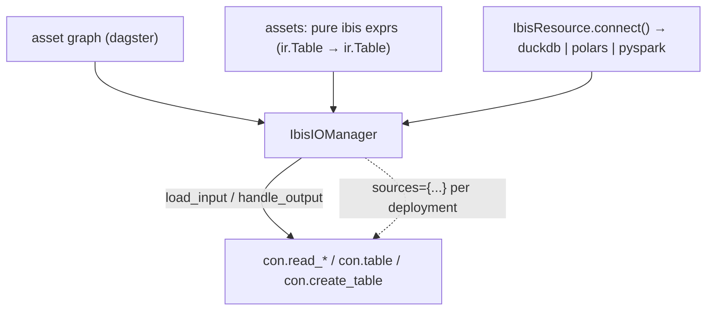

# ibis-dagster-example

An example [Dagster](https://dagster.io) project where all data logic is
written in [Ibis](https://ibis-project.org) expressions and runs on
**DuckDB**, **Polars**, or **PySpark**. Environment differences — which
engine executes, where inputs come from, where outputs land — are pure
resource configuration, following the standard Dagster patterns:

- **`ConfigurableIOManager`** owns all data I/O (`IbisIOManager`): assets are
  pure `ir.Table -> ir.Table` transforms; the manager persists outputs via
  `con.create_table` and resolves inputs via `con.table` / `con.read_*`.
- **`resources_by_deployment[DAGSTER_DEPLOYMENT_NAME]`** binds a
  differently-configured I/O manager + backend resource per environment —
  the documented Dagster equivalent of a per-env data catalog.



## Layout

```
src/ibis_dagster_example/
├── resources.py      # IbisResource: engine connection (cached per run)
├── io_manager.py     # IbisIOManager: asset<->table IO + source config
├── transforms.py     # the actual logic: pure, backend-agnostic ibis exprs
├── assets.py         # dagster assets: ir.Table in, ir.Table out
├── checks.py         # asset checks (dbt-test equivalents) as ibis exprs
├── data.py           # memtable fixtures (unit tests only)
└── definitions.py    # defs + resources_by_deployment + daily schedule
data/                 # local CSV sources (data/lake/ parquet is generated — see seed-lake)
scripts/seed_lake.py  # CSV -> parquet lake seeder for the prod deployment
justfile              # dev / materialize / seed-lake / test shortcuts
.pre-commit-config.yaml  # prek hooks at pre-push: ruff, ty, pytest
tests/                # transform tests per backend + offline dialect compiles
```

Asset graph: `events_csv` + `products_csv` (external sources) →
`raw_events` / `raw_products` (bronze) → `cleaned_events` (silver) →
`daily_active_users` + `category_revenue` + `latest_event_per_user` (gold).
The last one uses window functions — SQL backends only, see
[Portability boundaries](#portability-boundaries).

## Quickstart

```bash
just dev   # = DAGSTER_DEPLOYMENT_NAME=local uv run dagster dev (duckdb)
```

Pick the deployment — engine and storage switch together. The `just`
recipes are thin shortcuts; each expands to the raw command shown, which
works as-is without `just` installed:

```bash
just dev local    # DAGSTER_DEPLOYMENT_NAME=local   uv run dagster dev                 — duckdb + csv
just dev polars   # DAGSTER_DEPLOYMENT_NAME=polars  uv run dagster dev                 — polars + csv
just dev prod     # DAGSTER_DEPLOYMENT_NAME=prod    uv run --extra pyspark dagster dev — pyspark + parquet (needs JDK)
```

`dev prod` also needs parquet lake sources: the recipe first seeds
`data/lake/` from the CSVs (point `DATA_LAKE` elsewhere to use a real
lake). By hand: `uv run python scripts/seed_lake.py`, then export
`DATA_LAKE=data/lake`.

Headless:

```bash
just materialize polars
# = DAGSTER_DEPLOYMENT_NAME=polars uv run dagster asset materialize \
#     -m ibis_dagster_example.definitions --select "*"
```

(One expected failure on the `polars` deployment: `latest_event_per_user`
uses window functions, which ibis's polars backend can't translate — see
below. The rest of the graph still materializes.)

## How environments work

`definitions.py` holds `resources_by_deployment`: one configured
`IbisIOManager` (with a nested `IbisResource`) per deployment name.

```python
resources_by_deployment = {
    "local":  {"io_manager": IbisIOManager(ibis=IbisResource(backend="duckdb", ...), sources=CSV_SOURCES)},
    "polars": {"io_manager": IbisIOManager(ibis=IbisResource(backend="polars"),      sources=CSV_SOURCES)},
    "prod":   {"io_manager": IbisIOManager(ibis=IbisResource(backend="pyspark", ...), sources=LAKE_SOURCES)},
}
```

`DAGSTER_DEPLOYMENT_NAME` is just an env var `definitions.py` reads
itself — Dagster+ sets it automatically per deployment (`prod`,
`staging`, branch deployments); on a self-hosted OSS deployment set it in
the code location's environment (k8s/docker env, systemd unit); for
`dagster dev` export it yourself — unset defaults to `local`.

**Sources** — `IbisIOManager.sources` maps upstream asset names to reads:

```python
{"events_csv": {"format": "csv",     "path": "data/raw_events.csv"}}
{"events_csv": {"format": "parquet", "path": "${DATA_LAKE}/landing/events/"}}
{"events_csv": {"format": "table",   "name": "landing.events"}}  # existing table
```

`format` ∈ `csv | parquet | json | delta | table`; `path` supports
`${ENV_VAR}` expansion. Upstream assets *not* in `sources` resolve to
`con.table(<asset name>)` — pipeline tables.

**Outputs** — every materialized asset becomes `con.create_table(name,
overwrite=True)` on the backend (`name` = asset key, optional `database`
field namespaces them). Each materialization records `ibis_backend`,
`row_count`, a `preview`, and the compiled SQL/plan as metadata.

## Data quality (the `dbt test` analog)

`checks.py` defines `@dg.asset_check`s — the Dagster equivalent of dbt
tests. They run as steps in the same run, right after the asset they cover,
and are written as Ibis expressions evaluated on the backend — so the
quality gates are portable across engines too:

| check                                        | dbt equivalent      |
| -------------------------------------------- | ------------------- |
| `raw_events_not_empty`                       | implicit "has rows" |
| `raw_products_unique_product_id`             | `unique`            |
| `cleaned_events_no_null_user_ids` (blocking) | `not_null`          |
| `cleaned_events_unique_event_ids`            | `unique`            |
| `cleaned_events_accepted_event_types`        | `accepted_values`   |
| `cleaned_events_products_referential`        | `relationships`     |
| `daily_active_users_consistent_counts`       | custom/singular     |
| `category_revenue_non_negative`              | custom/singular     |

`blocking=True` on the not-null check reproduces `dbt build` semantics:
downstream assets don't materialize if it fails.

## Scheduling & dialect proof

- `daily_schedule` (`definitions.py`) runs `ibis_etl_job` daily at 06:00 —
  the `dbt run` cron analog (stopped by default; toggle in the UI).
- `tests/test_compilation.py` compiles every transform via
  `ibis.<backend>.compile()` — **offline, no engine needed** — for
  `duckdb`, `pyspark`, and `bigquery`, asserting dialect fingerprints
  (`DATE_TRUNC` vs `TIMESTAMP_TRUNC`, quoting styles). It's both the
  portability demo and a CI guardrail for backends you can't run locally.

Because both resources are `ConfigurableResource`s, every field can also be
overridden per-run in the Dagster Launchpad.

## Portability boundaries

"Backend-agnostic" means *portable across the ops a backend can express* —
not that every expression runs everywhere. The demo deliberately includes
one non-portable asset to show what the boundary looks like:

- `transforms.latest_event_per_user` uses `row_number().over(...)`. Ibis's
  polars backend has **no** `WindowFunction` translation (polars's native
  `.over()` isn't wired up), so on the `polars` deployment that asset fails
  with `OperationNotDefinedError: No translation rule for WindowFunction`.
- The failure is the good kind: it happens at translate time — before any
  data is processed — is deterministic, and names the missing op. It also
  means the compile test (`test_windowed_transform_not_supported_on_polars`)
  can pin the boundary in CI.

When a real project hits this, the options are:

1. **Rewrite portably** — often possible at some verbosity cost.
   `latest_event_per_user_portable` produces the same result with
   `group_by` + `inner_join`, and runs on every backend.
2. **Localize a backend branch** — inside a transform you can inspect the
   bound backend (`ibis.get_backend(t).name`) and shim one engine; ugly,
   but contained to one function.
3. **Keep the asset engine-scoped** — accept that a deployment can't
   materialize it (separate job, or document the failure as here).

Ibis maintains a per-backend [operations support matrix](
https://ibis-project.org/backends/support/matrix) — check it before
betting a codebase on a portability claim.

## Engine notes

- **duckdb** — persists to `IBIS_DUCKDB_PATH` (default `warehouse.duckdb`).
- **polars** — in-process/in-memory; tables live only for the run, so each
  run re-ingests from sources. Steps share one connection (in-process
  executor + cached connection in `IbisResource`).
- **pyspark** — lazily imported inside `connect()`; needs a JDK and the
  `pyspark` extra (`uv sync --extra pyspark`). `SPARK_MASTER` /
  `SPARK_WAREHOUSE_DIR` env vars configure it; point `SPARK_MASTER` at a
  cluster or Spark Connect URL. Sources are parquet under `DATA_LAKE`;
  `just seed-lake` writes a local lake at `data/lake/` from the CSVs.

## Tests

```bash
just test   # = uv run pytest; duckdb + polars; pyspark auto-skips if not installed
```

Covers the transforms on every backend plus full `dg.materialize` runs of
the asset graph through the I/O manager — including a "prod-style" variant
with parquet sources.

Lint (ruff), formatting, type-checking (ty) and this suite also run as
`prek`/`pre-commit` hooks at `git push` (`prek install --hook-type
pre-push`, or `prek run --all-files` to run them now).
